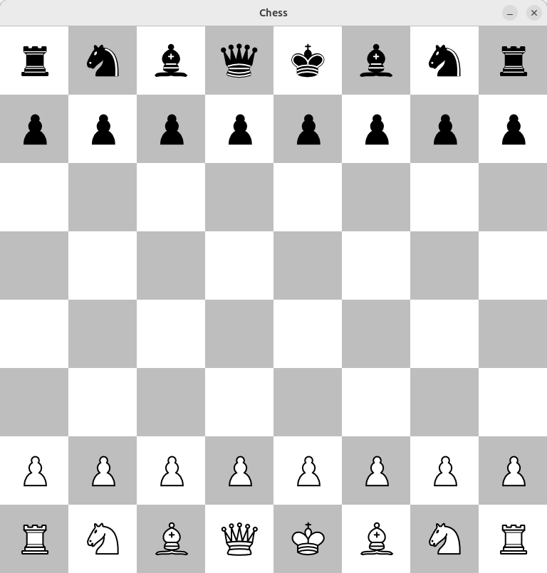

# ♟️ Chess Engine

This project is a chess engine developed using the [Pygame](https://www.pygame.org/) library. It focuses on the internal mechanics of the game, providing the core functionalities needed to simulate a chess game.

## 🎮 Features

- **Core Chess Logic**: Implements the rules and logic of chess, including piece movement and game state evaluation.
- **Move Validation**: Ensures all moves are legal according to the standard rules of chess.
- **Simple UI**: A basic graphical interface to visualize the board and piece movements.

## 🛠️ Technologies Used

- **Python**: The programming language used for development.
- **Pygame**: A library for rendering the graphical interface and handling user input.

## 🚀 Getting Started

To get a local copy of the project up and running, follow these steps.

### Prerequisites

Ensure you have Python installed on your system. You can download it from [Python's official website](https://www.python.org/downloads/).

### Installation

1. **Clone the repository:**

   ```bash
   git clone https://github.com/your-username/chess-engine.git
   cd chess-engine

2. **Install the required packages:**

   ```bash
   pip install pygame

3. **Run the game:**

   ```bash
   python main.py

### 📷 Screenshot



## 💬 Contact

Myroslav Yelechko - myronyelechko@gmail.com

Project Link: https://github.com/Vizi228/Chess